### DAS BF and GSC in Reverberating Scenarios

*DAS BF performs poorly in reverberating scenarios.* Experiments are shown in Figure \ref{DASBF_non_reverb} and Figure \ref{DASBF_reverb}. Two scenarios are based on same GUI setup and same speech/noise configurations (`speech1.wav` as desired signal and `whitenoise_signal_1.wav` as noise signal). The SNR in non reverberation scenario increases from 3.34 (DAS BF) to 15.31 (GSC). Figure \ref{DASBF_reverb} indicates that the steered mic signal is merely the compressed version of the original mic signal. In other words, we observed no improvement over SNR. Also, the noisy MUSIC pseudospectrum gives DAS BF wrong DOA to steer to.

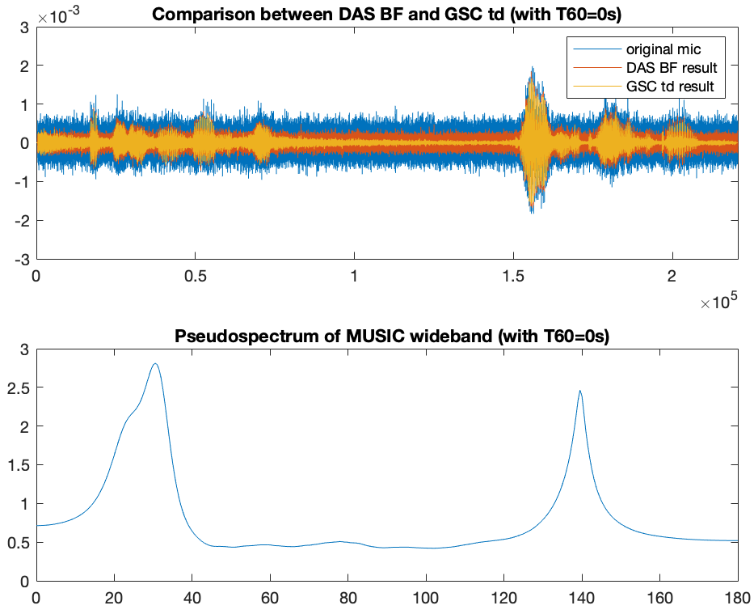

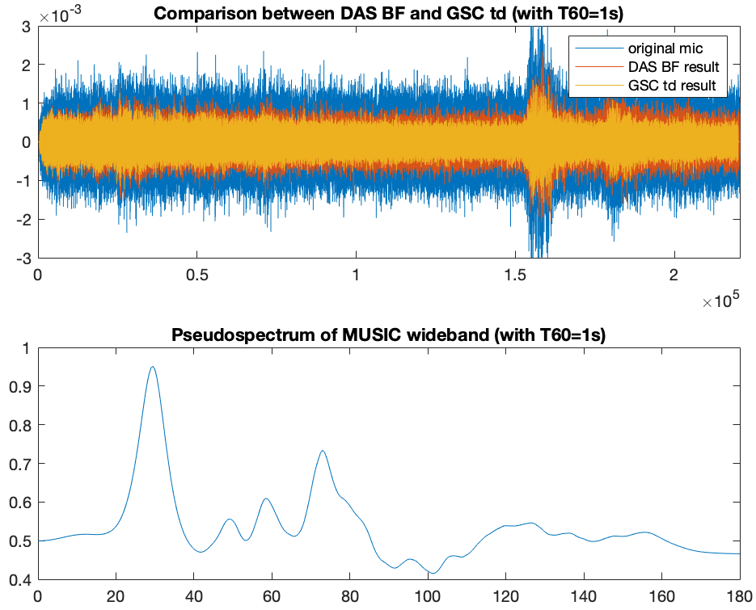

*the major reason DAS BF works poorly is **not** the mispredicted DOA generated by wideband MUSIC.* If the DOA ground truth measured in non-reverberation scenario is injected into the reverberation scenario while keeping whole setup consistant, we do not get a significantly better result w.r.t SNR. DAS BF works "as expected" when the DOA ground truth is given, but the reverberation side-effect is so large that the signal shape in each mic does not match after DAS process, as indicated in Figure \ref{DAS_BF_cmp_non_reverb}, \ref{DAS_BF_cmp_reverb_falseDOA}, and \ref{DAS_BF_cmp_reverb_trueDOA}.

We also observed that GSC in time domain does not work as expected when encountering reverberation. Compared Figure \ref{DASBF_reverb} with Figure \ref{DASBF_non_reverb} over GSC result, we can see clearly there is little "adaptation" of noise reduction during noise-only periods. We assume that because of reverberation, the impulse response has longer tails, so the noise-only period determined by clean speech signal contains speech related signals, resulting into overall amplitude reduction instead of noise reduction. For verify our thought, we built another VAD by manually labeling the speech peroid, as denoted in Figure \ref{cmp_VAD_hand_crafted}. Here we can see that there is no improvement of GSC result. From this experiment, we assume that the effect of long reverberationn tail is spreaded over entire time period. We do not get sufficient evidence to prove this assumption.

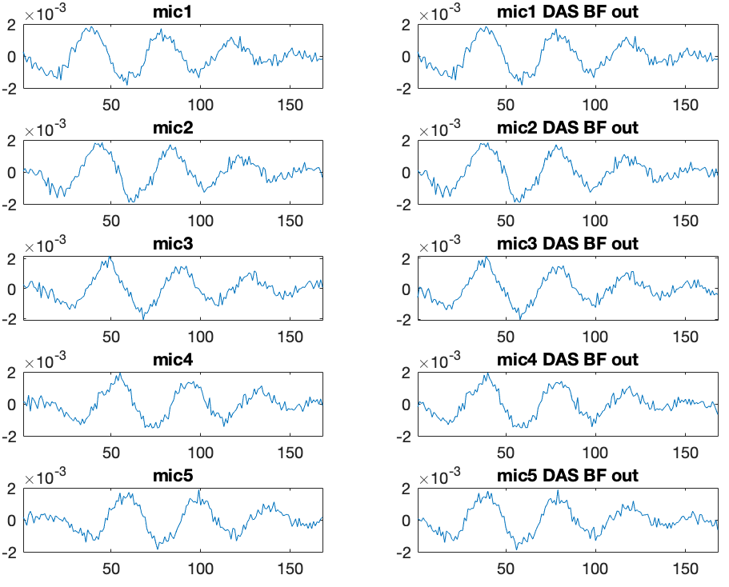{height=220px}

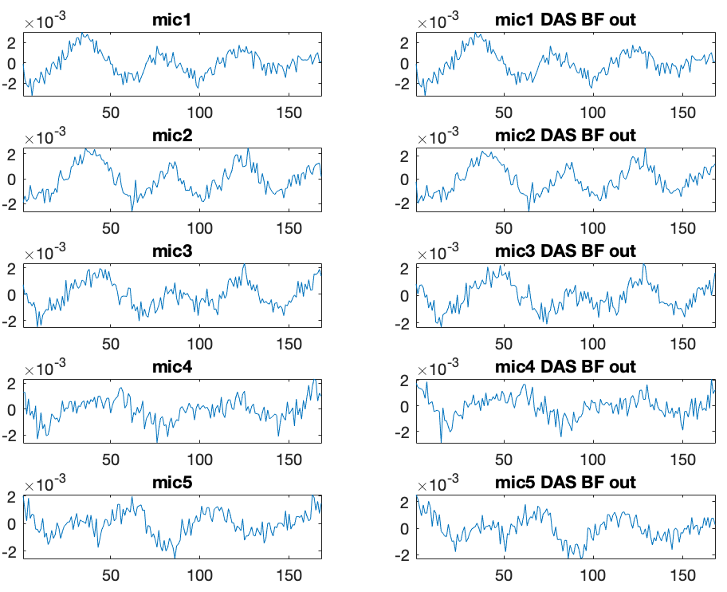{height=220px}

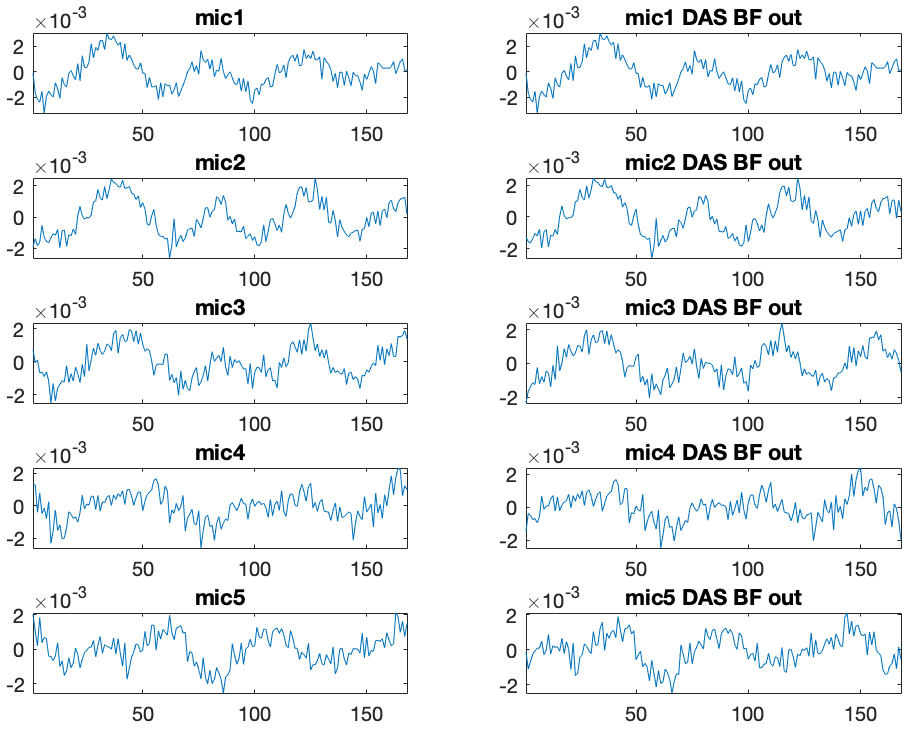{height=220px}

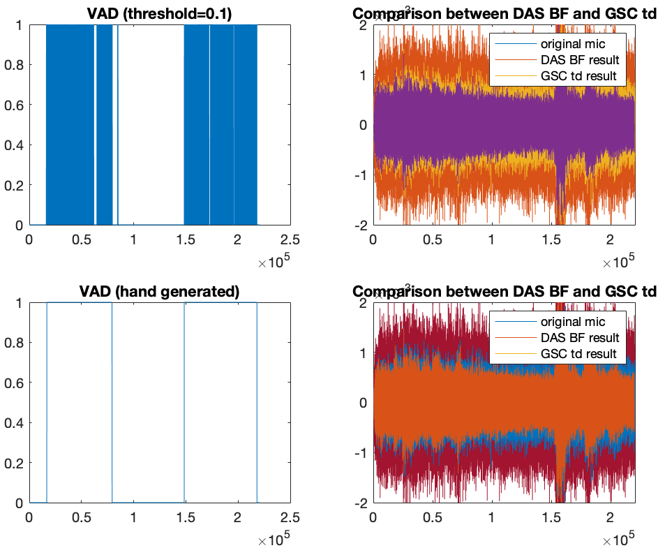

Additionally, we can tune the stepsize in time domain GSC. When stepsize is bigger, the convergence speed er, but the resulting filtered signal is 'spiky' due to the overshoot in noisy periods hidden inside the majority of speech periods. The hidden noisy periods are shown in the upper left subplot of Figure \ref{cmp_VAD_hand_crafted}.

To sum up this chapter, when reverberation is introduced, DAS BF operated in time domain has a low SNR, even if the input DOA is correct. GSC performs badly when encountering reverberation, we think the reason is the long tail of reverberation, but we cannot design an *effective* test to prove this. Moreover, the steering vector `h` introduced in FAS BF can make DOA estimation more accurate. The adaptation is not finished.

### FAS BF and Frequency Domain GSC

Expected observation is: *FAS BF has same performance as DAS BF during anachoic scenarios, but better when there is reverberation.* Comparison in non-reverberation scenario is shown in Figure \ref{cmp_fd_td_non_reverb}. However, from the result, the amplitude of GSC (frequency domain) is lower than GSC (time domain). This is an undesired result, the consequence is amplified during time-varying scenarios. However, when we tested GSC in reverberation scenario, the results are not promising, as shown in Figure \ref{cmp_td_fd_reverb_bad}.

After attaining FAS BF result, we can tune GSC over these hyper parameters:

- `speech_percentage_threshold`: We need to convert time-domain VAD vector (with a length of time samples) into STFT-domain VAD vector (with a length of time frames). This requires a similar sliding-window operation as STFT. For each frame, if the percentage of `VAD==1` is bigger than this threshold, then the whole frame is registered as "speech period". Otherwise, this frame is registered as "noise-only period". If this threshold is set small, then more noise components are included in "speech period", and the number of "noisy" frames for updating GSC coefficients will be reduced, so there exists a tradeoff.
- `mu`: GSC coefficients updating stepsize. If `mu` is set large, the convergence speed will be fast, but there exists possibilities that the filter will be unnstable, resulting into unbounded oscillating waveform.
- `L`, or the number of frequency bins.

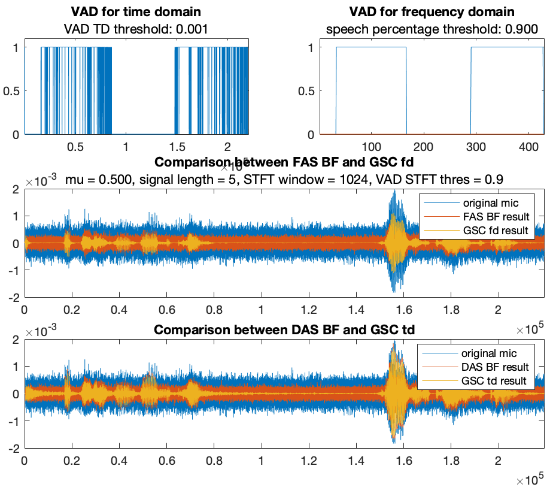

In reverberating scenarios with the same audio setup (`speech1.wav` as desired signal and `whitenoise_signal_1.wav` as noise signal) and the same parrameter setup as Figure \ref{cmp_fd_td_non_reverb}, the result is not good, see Figure \ref{cmp_td_fd_reverb_bad}. We can observe that:

- The adaptation is slower than Figure \ref{cmp_fd_td_non_reverb} with the same `mu`.
- The speech signal is also cancelled by GSC adaptive filter.

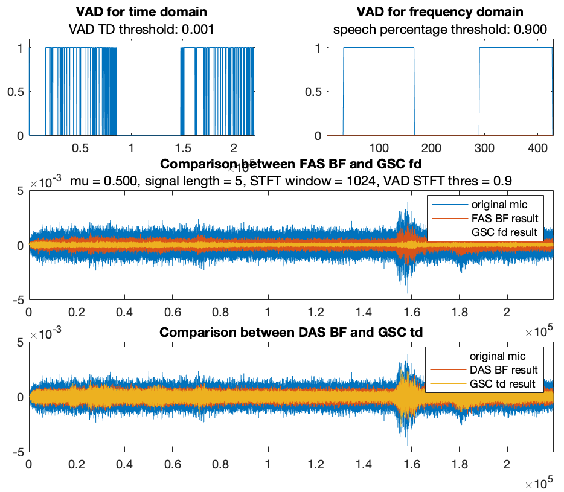

Possible explainations are: 1) the stepsize `mu` is not big enough, 2) the STFT size `L` (or the number of frequency bins) is set too large that there are no sufficient noisy frames for the adaptive filter to converge. We have tried different `L`, `mu`, along with different thresholds of VADs. Till now, we didn't give a sound result proving that FAS BF along with frequency domain GSC is better than the process in time domain, and we consider this as undesired results.

### Experiments on Time Varying Scenarios

Because of the unsuccessful frequency domain experiments over reverberation scenarios, we conducted experiments only ove anachoic time varying scenarios. We use 5 different GUI configurations, each last for 10 seconds, resulting into a total of 50 seconds mic signal. The predefined speech DOA is `[63 47 50 30 59]`, and the noise DOA is predefined as `[133 113 108 141 106]`, both in degrees. Zero degree is defined as the left hand side of the mic array. We use a sliding window mechanism for dynamically detemining DOAs (MUSIC) and reducing noise (GSC time domain and frequency domain), along with correct mapping of time/frequency domain VADs into each sliding window. Figure \ref{cmp_td_fd_time_vary_non_reverb} shows the comparison in time varying scenario with the same audio setup.

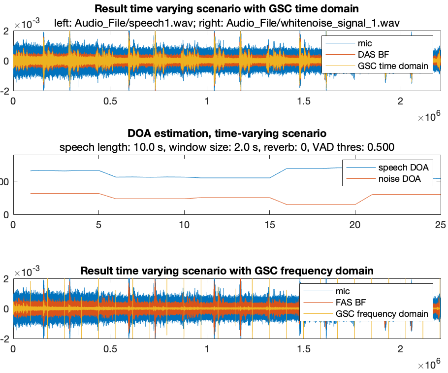

Several remarks:

- There are some spikes in between different time windows in the frequency domain GSC waveform. This is because the length of one time window cannot be perfectly divided by `L`. To solve this problem, the length of time window should be a multiple of `L`, which introduces additional constraint.
- The middle subplot indicates the prediction of DOA with time. The result perfectly matches the predefined GUI scenarios.
- The weights in adaptive filter of GSC (both time and frequency domain) is passed betweed two consecutive time windows to avoid performance dropping introduced by another round of parameter updating from zero.
- Although with the same setup as Figure \ref{cmp_fd_td_non_reverb}, the results do not match, which is not desired. In Figure \ref{cmp_fd_td_non_reverb}, the amplitude of speech periods between FAS BF and GSC frequency domain are almost the same, but here Figure \ref{cmp_td_fd_time_vary_non_reverb} shows amplitude reductions. We consider the reason as internal code bugs, which is not fixed yet.

### Experiments over Measured IRs

We experimented the measured impulse response of linear microphone arrays. The problem we observed is that the pseudospectrum obtained in wideband MUSIC is noisy, and the locations of peaks are not desired, as shown in Figure \ref{pseudospectrum_measured_LMA}. The DOAS should be around 60 and 120 degrees.

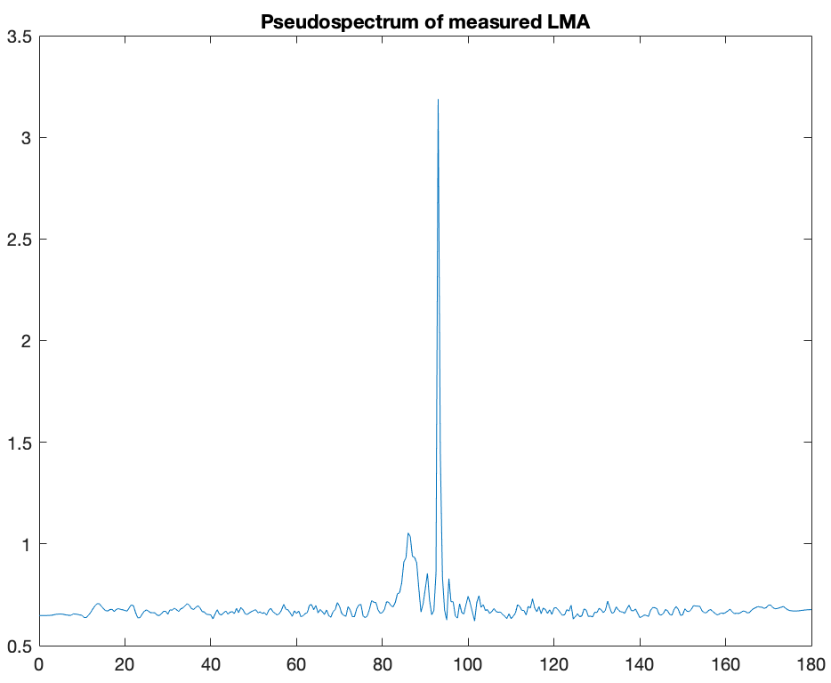

We further confirmed the correctness of mic IRs, as shown in Figure \ref{LMA_measured_IRs}. We can see there is clearly reasonable delays in each set of mics. We will further ask the IRs from other teams and compare these results.

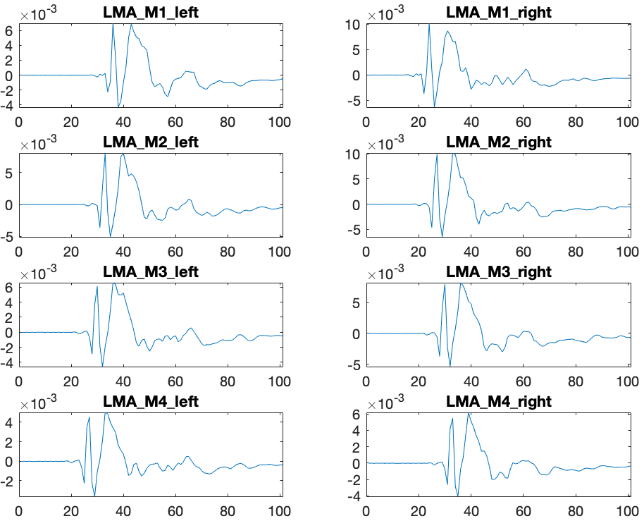

Because of the reverberation in measured room, the result of frequency doamin GSC is still not reasonable. See Figure \ref{measured_fd_false}. 

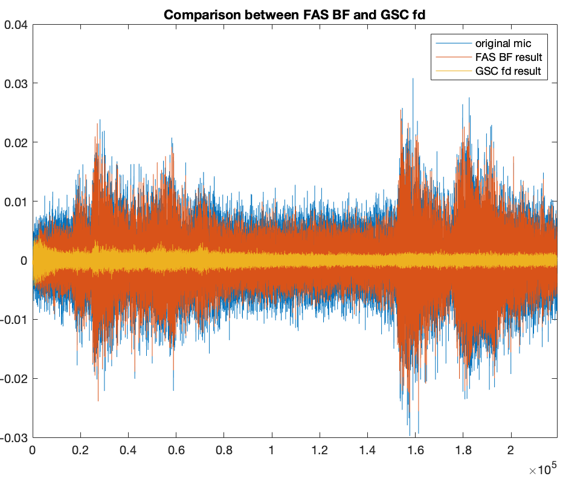

We did not completed the experiment of measured IRs of head mount yet.